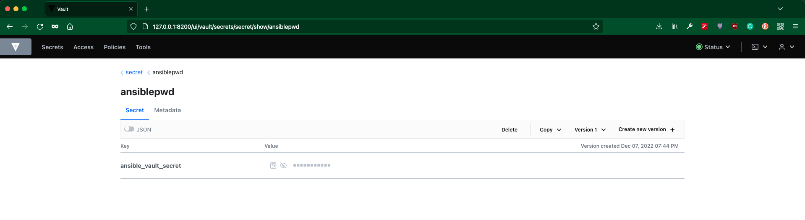

Ansible SDK vault example
=========================

In this scenario, we have an encrypted playbook called ``enc_pb.yml`` located in ``datadir/project`` directory. The Ansible Vault secret used to encrypt this playbook is ``Secret123``. We can store this vault secret in the HashiVault Server.

Vault Secret is stored in HashiVault as - 




Using ``env/cmdline`` file, we are specifying ``get_password.sh`` to retrieve password from HashiVault Server using ``vault`` command.

The contents of ``env/cmdline`` are - 

```
--vault-password-file=./get_password.sh
```


